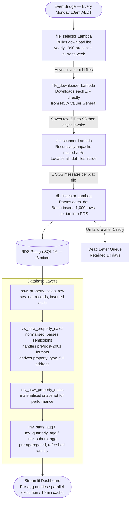

## NSW Property Sales

An end-to-end data pipeline that ingests every NSW property sale recorded since 1990 — over **150,000 files processed**, **35+ years** of transactions, updated automatically every Monday.

**Dashboard → [nsw-property-data.streamlit.app](https://nsw-property-data.streamlit.app/)**

**Data source → [NSW Valuer General](https://valuation.property.nsw.gov.au/embed/propertySalesInformation)**

---

## Architecture

Likely caused by a few things Mermaid's parser can choke on:

- **`**bold**` inside node labels** — not standard Mermaid syntax, can break parsing
- **Emojis** — hit or miss depending on the renderer
- **`·` middle dot** — can cause issues

Here's a clean, safe version without those:


---

## AWS Components

| Service | Role |
|---|---|
| **EventBridge** | Cron trigger — fires every Monday 10am AEDT |
| **Lambda × 4** | file_selector → file_downloader → zip_scanner → db_ingestor |
| **S3** | Stores raw ZIPs and extracted .dat files |
| **SQS** | Decouples zip_scanner from db_ingestor; one message per .dat file |
| **SQS DLQ** | Catches failed ingestor messages after 1 retry, retained 14 days |
| **RDS PostgreSQL 16** | t3.micro, private subnet — stores all sales data |
| **Lambda Layer** | Shared Python dependencies (psycopg2) across all functions |
| **CloudWatch** | Dashboard + Lambda execution metrics |
| **Terraform** | All infrastructure defined as code, single `terraform apply` deploy |

### Why this shape?

- **fan-out via async Lambda invokes** — file_selector triggers one file_downloader per file in parallel, so files don't queue up sequentially
- **SQS between scanner and ingestor** — absorbs bursts, provides natural retry/DLQ boundary, and lets Lambda scale concurrency independently 
- **batch inserts of 1,000 rows** — amortises RDS round-trip cost without hitting transaction size limits
- **pre-aggregated MVs** — dashboard queries hit small pre-rolled tables instead of scanning millions of raw rows on every page load

---

## Database

Raw `.dat` records land in `nsw_property_sales_raw` unchanged. A normalised view on top handles the two historical file formats (field layouts changed after 2001), constructs full addresses, and derives property type from unit and strata fields. A materialized snapshot sits above that for query performance, with three further pre-aggregated views refreshed every Monday after ingestion completes.

---

## Dashboard

Built on Streamlit Cloud — queries run in parallel via `ThreadPoolExecutor`, results cached for 10 minutes, backed entirely by pre-aggregated materialized views so page loads stay fast regardless of filter combination.

---

## Repo Structure

```
├── functions/          4 Lambda handlers + shared requirements
├── database/           schema, views, indexes, refresh scripts
├── streamlit/          dashboard app
└── terraform/          all AWS infrastructure as code
```

---

## Deploy

```bash
cd terraform
terraform init && terraform apply
```

Creates: 4 Lambdas, RDS instance, S3 bucket, SQS + DLQ, EventBridge rule, CloudWatch dashboard, Lambda layer.
